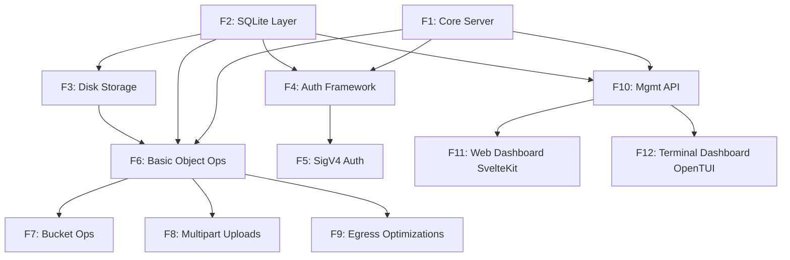

# Feature Dependencies

To prevent blocking team members, features must be tackled according to this dependency graph.

| Feature | Name | Depends On | Reasoning / Blocker |
| :--- | :--- | :--- | :--- |
| **F1** | Core Server & Routing | *None* | Foundational backend scaffolding. |
| **F2** | SQLite Metadata Layer | *None* | Can be built alongside F1. |
| **F3** | Disk Storage Engine | **F2** | Needs DB schema to log file states. |
| **F4** | Auth Framework | **F1, F2** | Requires router (F1) and user tables (F2). |
| **F5** | AWS SigV4 Auth | **F4** | Extends the base authentication framework. |
| **F6** | Basic Object Ops | **F1, F2, F3** | Needs router, disk writer, and DB state. |
| **F7** | Bucket Operations | **F2, F6** | Needs objects in the DB to list them. |
| **F8** | Multipart Uploads | **F3, F6** | Extends basic object operations. |
| **F9** | Egress Optimizations | **F6** | Optimizes the already working `GET` requests. |
| **F10** | Management API | **F1, F2** | Needs routing and DB access to manage keys/tokens. |
| **F11** | SvelteKit Web UI | **F10** | Needs the backend API to be stable to fetch data. |
| **F12** | OpenTUI CLI | **F10** | Needs the backend API to be stable to fetch data. |

### Graph Representation

